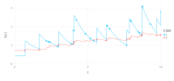
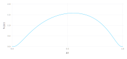
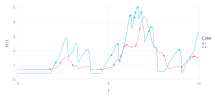
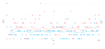
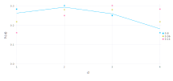

# Tutorial

## Background
Hawkes processes are a class of inhomogeneous, autoregressive Poisson processes used to model the arrival of events that demonstrate self-exciting behavior, e.g., seismic activity. The intensity of a univariate Hawkes process given a sequence of events ``\{ s_i \}_{i=1}^N`` is given by the expression
```math
\lambda(t) = \lambda^{(0)}(t) + \sum_{s_i < t} h(t - s_i \ | \ \theta),
```
where ``\lambda^{(0)}`` is the (possibly inhomogenous) baseline intensity of the process in the absence of events, and ``h(\Delta t)`` is a non-negative impulse response that captures the increase in intensity due to each event. Simply put, every event arrival temporarily increases the likelihood of future events.

Multivariate Hawkes processes introduce the possibility of interactions between processes. The intensity of the ``n``-th process given a sequence of events ``\{ s_i \}_{i=1}^N`` occurring on corresponding processes ``\{ c_i \}_{i=1}^N`` is given by
```math
\lambda_n(t) = \lambda_n^{(0)}(t) + \sum_m \sum_{\substack{c_i = m,\\ s_i < t}} h_{m \rightarrow n}(t - s_i \ | \ \theta_{m \rightarrow n}),
```
where the impulse response ``h(\Delta t \ | \ \theta_{m \rightarrow n})`` now depends on the "parent" process, ``m``, and "child" process, ``n``.

`NetworkHawkesProcess.jl` implements a class of probabilistic models that combines multivariate Hawkes processes with network models ([Linderman, 2016](https://dash.harvard.edu/handle/1/33493391)). The intensity of such models takes the form

```math
\lambda_n(t) = \lambda_n^{(0)}(t) + \sum_m \sum_{\substack{c_i = m,\\ s_i < t}} a_{m \rightarrow n} h_{m \rightarrow n}(t - s_i \ | \ \theta_{m \rightarrow n}),
```
where ``a_{m \rightarrow n}`` is a binary variable representing the existence of a directed link from process ``m`` to process ``n`` generated by a process

```math
a_{m \rightarrow n} \sim p(a_{m \rightarrow n} \ | \ \eta_{m \rightarrow n})
```

These models–network Hawkes processes–permit simultaneous inference on the structure of a network and its event generating process. The following sections demonstrate how to use this package to construct, simulate, and perform inference on such processes.

## Continuous Network Hawkes Processes
This section explores the continuous-time network Hawkes process. We'll examine the component parts of the process, generate simulated data, and learn how inference works. 

Let's start by reviewing the multivariate, continuous-time network Hawkes process. The process consists of ``n`` Poisson processes, with the intensity of its ``n``-th node taking the form

```math
\lambda_n(t \ | \ \{s_m, c_m \}) = \lambda_n^{(0)}(t) + \sum_{s_m < t} a_{c_m \rightarrow n} \cdot w_{c_m \rightarrow n} \cdot \hbar(\Delta t; \theta_{c_m \rightarrow n})
```

- ``\lambda_n^{(0)}`` is the *baseline* intensity of the process, which represents the intensity of the process in the abscence of events.

- ``a_{c_m \rightarrow n}`` is the ``(c_m, n)``-th component of the binary *adjacency matrix*, ``\mathbf{A}``. The components of ``\mathbf{A}`` determine whether connections exists between nodes in the network. If no connection exists between nodes ``i`` and ``j``, then events on node ``i`` have no effect on the intensity of node ``j``. The model assumes that ``\mathbf{A}`` is generated by a *network model*, as described below.

- ``w_{c_m \rightarrow n}`` is the ``(c_m, n)``-th component of the *weight matrix*, ``\mathbf{W}``. Whereas ``a_{i, j}`` determines the existence of a connection from node ``i`` to node ``j``, ``w_{i, j}`` determines the connection's *strength*.

!!! note
    
    In generally, the weight matrix can also be modeled as the result of a network-type model, but this option is not currently supported.

- ``\hbar(\Delta t ; \theta_{c_m \rightarrow n})`` is a non-negative *impulse response* function, which controls the evolution of the ``n``-th node's response to events on node ``c_m``. Its shape is determined by connection-specific parameters ``\theta_{c_m \rightarrow n}``. 

In summary, the continuous-time network Hawkes process is a network of interacting Poisson processes, which consists of: a baseline, an adjacency matrix, a weight matrix, and an impulse response function. Now let's create some of these processes in `NetworkHawkesProcesses` to see how this all works.


### Standard Hawkes Processes
`NetworkHawkesProcesses` allows users to contruct models with network structure, but let's start by considering a simpler, "standard" Hawkes model, which we construct as follows:
```julia
nnodes = 2;
baseline = HomogeneousProcess(rand(nnodes));
impulses = ExponentialImpulseResponse(rand(nnodes, nnodes));
weights = DenseWeightModel(rand(nnodes, nnodes));
process = ContinuousStandardHawkesProcess(baseline, impulses, weights);
```

The process is straight-forward: define the component parts, then define the process. But let's take a look at the component parts to understand what we've just created.

#### Baseline
First, we need to define a baseline intensity. The simplest choice is a homogeneous Poisson process:

```math
\lambda_n^{(0)}(t) = \lambda_n^{(0)}
```

We can create this process using `HomogeneousProcess`:

```julia
nnodes = 2;
baseline = HomogeneousProcess(rand(nnodes))
```

However, a constant baseline intensity is unrealistic in many applications. The package also provides a flexible alternative, the `LogGaussianCoxProcess`. This process uses [Gaussian processes](https://en.wikipedia.org/wiki/Gaussian_process) to capture time-varying intensity, which is particularly useful when modeling processes with (e.g.) known periodic properties. We'll consider the `LogGaussianCoxProcess` more closely later.

#### Weights
Next, we need to define our weight model. In general, a weight model can be any network model that generates a non-negative weight matrix. Currently, the package only provides a simple weight model that represents weights as a constant matrix:
```julia
weights = DenseWeightModel(rand(nnodes, nnodes))
```

#### Impulse Response
Finally, we need to define an impulse response. Constraining ``\hbar`` to be a valid probability density ensures that it *only* determines the timing of responses because each impulse response integrates to one, and therefore contributes identically to the likelihood of events. Additionally, each ``w_{n' \rightarrow n}`` becomes the *expected* number of events on node ``n`` resulting directly from a single event on node ``n'``. In other words, we can meaningfully compare weights.

Let's start with a classic choice, the exponential distribution:
```math
\hbar(\Delta t; \theta_{n' \rightarrow n}) = \theta_{n' \rightarrow n} \exp \{-\theta_{n' \rightarrow n} \cdot \Delta t \}
```


We create this model with the `ExponentialImpulseResponse` struct:

```julia
impulses = ExponentialImpulseResponse(rand(nnodes, nnodes))
```

In addition to specifying the actual impulse response function, this model defines data and logic used for inference. We'll skip these details for now.

#### Stability
Before we move on, we should note that we have assigned random values to our model parameters. While these values are valid for the component models, they may lead to an *unstable* process, i.e., whose intensity eventually "blows up". Let's check if our process is stable:

```julia
isstable(process)
```

This function simply checks the stability condition:

```math
\max_{| \lambda |} \text{eig} \left( \mathbf{A} \odot \mathbf{W} \right) < 1.0
```

#### Simulation
Next, let's examine what data generated by this process looks like. Following Julia convention, random data is generated using the `rand` method. For example, here's how to simulate data for a period of length `T=10.0`:

```julia
events, nodes, duration = rand(process, 1000.0)
println("(process generated $(length(events)) events)")
```

Notice that the output of a continuous process has three parts: a list of event times (`events`), followed by a list of corresponding event nodes, and the duration of the simulation. The reason we return `duration` is that it is required for continuous-time inference methods. Returning it means that we run inference directly on the output of `rand`, i.e., without unpacking as above.

Let's take a look at our data:
```julia
data = (events, nodes, duration)
plot(processs, data)
```



Each point of the plot represents an event, and the curves represent the intensity of the nodes. The exponential impulse reponse function produces an instantaneous increase in intensity after each event, which is followed by a gradual decline. This puncuated behavior is undesirable or unrealistic in many applications. For that reason, `NetworkHawkesProcesses` provides a more flexible impulse resopnse function based on the logit-normal distribution:
```math
\hbar(\Delta t; \mu_{n' \rightarrow n}, \tau_{n' \rightarrow n}) = \frac{1}{Z} \exp \Bigg \{ \frac{-\tau_{n' \rightarrow n}}{2} \left( \sigma^{-1} \left( \frac{\Delta t}{\Delta t_{\text{max}}} \right) \right) \Bigg \}
```

``\hbar`` is again a proper probability distribution on ``[0, \Delta t_{\text{max}}]``, where ``\Delta t_{\text{max}}`` is a hyperparameter (i.e., not learned through inference). The distribution provides flexibility in the timing of the impulse response at the cost of a second parameter, ``\mathbf{\tau}``, as demonstrated in the figure below.



`LogitNormalImpulseResponse` implements this impulse reponse function along with all methods required to perform statistical inference. Let's update our process to use this impulse response and generate a new sample:

```julia
Δtmax = 1.0;
impulses = LogitNormalImpulseResponse(rand(nnodes, nnodes), rand(nnodes, nnodes), Δtmax);
process = ContinuousStandardHawkesProcess(baseline, impulses, weights);
events, nodes, duration = data = rand(process, duration);
println("(process generated $(length(events)) events)")
```

As demostrated in the following figure, the response to events is now noticably delayed:



#### Inference
Typically, our interest is in learning the parameters of a model given data collected from an experiment or real-world dataset. `ContinuousStandardHawkesProcess` is compatible with maximum-likelihood estimation (`mle!`) and Markov chain Monte Carlo (Gibbs) sampling (`mcmc!`) methods:
```julia
using NetworkHawkesProcesses: params
orginial_process = deepcopy(process)
mle!(process, data; verbose=true, regularize=true); # regularize w/ prior
[params(process) params(original_process)]
```

Note that inference methods in `NetworkHawkesProcesses` are mutating operations. That is, they update the parameters of the process they are called on. In this case, we saved a copy of the original process for comparison with our inference results, but we wouldn't normally need to make a copy. Notice as well that we did not initialize these methods. Behind the scenes, `mle!` and `mcmc!` created default, random initial guesses of the model parameters. You can override the default value by providing a `guess` parameter. For example, we could use the results of maximum-likelihood estimation as initial parameter values for Gibbs sampling.


### Networks
At this point, our model allows us to infer the strength of connections between nodes, but not whether such connections actually exist. A simple approach to predicting connections is to apply a hard threshold to estimates of ``\mathbf{W}``, i.e., ``
\hat{w}_{m \rightarrow n} \leftarrow \min \left( \hat{w}_{m \rightarrow n} - w_{\text{min}}, 0 \right)``. The network Hawkes model provides a more disciplined approach by specifying a generative model for network connections.

In general, a network model takes the form

```math
p(\mathbf{A} \ | \ \mathbf{z}, \mathbf{\nu}) = \prod_{n=1}^N \prod_{n'=1}^N p(a_{n \rightarrow n'} \ | \ z_n, z_{n'}, \mathbf{\nu}) = \prod_{n=1}^N \prod_{n'=1}^N \text{Bern}(a_{n \rightarrow n'} \ | \ \rho_{n \rightarrow n'})
```

where ``\rho_{n \rightarrow n'} = f(a_n, z_n, z_{n'}, \nu)``. In the probabilistic modeling lingo, ``z_i`` are referred to as "local" parameters and ``\nu`` is called a "global" parameter. `NetworkHawkesProcesses` has one such model built-in, the so-called Bernoulli network,
```math
p \left( a_{n \rightarrow n'} \right) = \text{Bern} \left( a_{n \rightarrow n'} \ | \ \rho \right),
```

which is implemented by the `BernoulliNetworkModel` struct. Constructing a continuous-time Hawkes process with this network model imposed on interactions is straight-forward:
```julia
baseline = HomogeneousProcess([1.0, 2.0]);
weights = DenseWeightModel([0.1 0.2; 0.2 0.1]);
impulses = LogitNormalImpulseResponse(ones(nnodes, nnodes), ones(nnodes, nnodes), Δtmax);
network = BernoulliNetworkModel(0.5, nnodes);
links = [1 0; 1 1];
process = ContinuousNetworkHawkesProcess(baseline, impulses, weights, links, network);
```

The steps are similar to those used to create a standard Hawkes process. We pass the baseline, weights, and impulse response models to `ContinuousNetworkHawkesProcess` as before, but we now also include the network model and binary connection matrix, `links`, which takes the same form as a realization of network model (we could have also done `links = rand(network)`).

Simulating data works exactly as before:
```julia
data = rand(process, duration);
```

Maximum-likelihood estimation isn't permitted for network Hawkes processes due to the binary adjacency matrix. However, we can still perform Gibbs sampling:
```julia
res = mcmc!(process, data; verbose=true);
```

By default, `mcmc!` resamples the process parameters `nsteps=1000` times, and the samples are stored in `res.samples`. For example, we can get point estimates of model parameters by taking statistics of the samples:
```julia
using Statistics
mean(res.samples)
```

!!! note
    
    Taking the median sample is the more typical choice, but `median` doesn't work on vectors, unfortunately. Instead, we can take medians of individual elements with `median([x[1] for x in res.samples])`.


## Discrete Network Hawkes Processes
Discrete-time processes are similar to their continuous-time counterparts in most respects. Essentially, model components are discretized in the time dimension, where applicable. This means that baselines become discrete-time Poisson processes and impulse responses are translated to discrete distributions, but there is *no change* to network models or weights.

What might we want to use a discrete-time model? The primary motivation for discrete-time processes is faster inference. When events occur frequently, discrete-time processes offer faster inference because several events fall into the same time bin. Thus, discrete-time inference scales linearly with number of *time bins*. In contrast, continuous-time models scale quadratically with the number of events (although this is mollified by introduction of maximal look-back periods)[^1]. In addition, the discrete-time model permits variational inference, which leads to further computational gains (at the cost of simlifying dependence structures). Furthermore, in many cases we may only have access to discrete data, which necessicates a discrete-time model.

[^1]: On the other hand, discrete-time processes offer lower resolution: they cannot capture "instantaneous" interactions between events. 

Here's how we would implement the previous example using a discrete-time model instead:

```julia
nnodes = 2;
nbasis = 3;
nlags = 4;
duration = 1000;
dt = 1.0;
baseline = DiscreteHomogeneousProcess([1.0, 2.0], dt);
weights = DenseWeightModel([0.1 0.2; 0.2 0.1]);
impulses = DiscreteGaussianImpulseResponse(ones(nnodes, nnodes, nbasis) ./ nbasis, nlags, dt);
process = DiscreteStandardHawkesProcess(baseline, impulses, weights, dt);
data = rand(process, duration);
res = mle!(process, data; verbose=true, regularize=false); # or mcmc!, vb!
ll = loglikelihood(process, data)
```

There are several important differences to take note of. First, we now need to choose a time step size for the process, `dt`, which is also provided to all components that involve time (i.e., the baseline, impulse-response). Second, we use a discrete-time baseline process, `DiscreteHomogeneousProcess`, which is an exact discretized analog of `HomogeneousProcess`. `NetworkHawkesProcesses` also provides a discrete-time version of the non-homogeneous log Gaussian Cox process,  `DiscreteLogGaussianCoxProcess`. Third, we instantiate a discrete-time impulse response, `DiscreteGaussianImpulseResponse`, which has no continuous-time analog and is explained in detail below. Finally, `data` is now a `Matrix{Int64}` of size `nnodes x duration` containing event counts for each node along its rows. (Unlike the continuous-time model, we don't need to return nodes, events, and duration separately because they are implied by the data matrix dimensions).



### Discrete-time Impulse Responses
Whereas continuous-time impulse responses are typically determined by probability density functions, discrete-time impulse responses are specified by probability *mass* functions (i.e., points on a simplex). The approach of `NetworkHawkesProcesses` is to construct such impulse responses as mixture models. That is, for a family of (scaled) basis distribution functions, ``\phi_b: \{ 1, \dots, D \} \rightarrow [0, 1]`` for ``b = 1, \dots, B``, the impulse response is defined as
```math
\hbar[d; \theta_{n \rightarrow n'}] = \sum_{b=1}^B \theta_{n \rightarrow n'}^{(b)} \cdot \phi_b[d] \\
\sum_{d=1}^D \phi_b[d] \cdot \Delta t = 1 \\
\sum_{b=1}^B \theta_{n \rightarrow n'}^{(b)} = 1
```

The discretized Gaussian family of basis functions is the only family currently provided by `NetworkHawkesProcesses` via the `DiscreteGaussianImpulseResponse` type. It's members are defined by
```math
\phi_b[d] = \frac{\exp \{ -\frac{1}{2} \left( d - \mu_b \right)^2 \} }{\Delta t \cdot Z}
```

where ``\mu_b`` are evenly spaced on ``[1, D]``, ``\sigma = \frac{D}{B - 1}``, and ``Z`` is a normalization constant. An example of one such distribution is shown below.




### Variational Inference (TODO)
- Finally, discrete-time processes have an additional inference option, `vb!`, which performs [variational Bayes](https://www.jmlr.org/papers/volume3/blei03a/blei03a.pdf) inference
- (TODO) Run `vb!` and demonstrate how the output works since it is a bit different than `mcmc!`


## Extensions (TODO)
The modular design of `NetworkHawkesProcesses` allows users to create custom models. Users can create custom models by mixing and matching component parts, or by creating their own components. This tutorial has already demonstrated how to replace switch model components (e.g. replacing one impulse response model for another), so let's take a look at the second option more closely.

Earlier in the tutorial we mentioned that the homogeneous baseline intensity is not always an appropriate modeling assumption. `NetworkHawkesProcesses` provides an flexible alternative, `LogGaussianCoxProcess`, which we can use as a example in order to understand how to create new baseline models in general.

### Networks
Any of the core components—baselines, weights, etc.—can be customized by implementing its interface, as demonstrated above. However, `Networks` are perhaps the easiest and most interesting components to customize because the `Network` interface consists of only a handful of methods, and because many network models permit exact Gibbs sampling.

At a minimum, a network model must provide the following methods:
- `size(network)`
- `params(network)`
- `rand(network)`

Gibbs sampling requires the additional methods:
- `link_probability(network)`
- `resample!(network, data)`

And variational inference requires:
- update!(network, probs)
